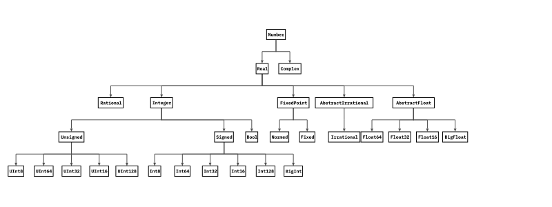

# A Review of Julia Programming Language

This repo holds a basics review of the Julia programming language. Thanks to this [youtube video](https://www.youtube.com/watch?v=sE67bP2PnOo&ab_channel=DerekBanas) for the tutorial on [Julia](https://julialang.org/).

## Importing packages
We can import packages by `using` keyword:
```julia
using Printf
println("Hello World!")
```
> Hello World!

## Variables
Variables can be either dynamically or strictly typed. Following shows an example variable declaration:
```julia
using Printf
name :: String = "John"

println("Hello " * name * "!")
```
> Hello John!

The following is a list of primitive types in Julia:
- Number types:
  - `Number` is the abstract number type which all numbers are an instance of.
  - `Integer` is the asbtract integer type with `Signed` and `Unsigned`.
    - `Int8`, `Int16`, `Int32`, `Int64`, `Int128` are different signed integer types with specific sizes.
    - `UInt8`, `UInt16`, `UInt32`, `UInt64`, `UInt128` are different signed integer types with specific sizes.
  - `AbstractFloat` is the abstract float which can be of any size. `Float16`, `Float32`, `Float64` are float types with specific sizes.
- Character types:
  - `Char` is a single char such as `'a'`. Characters in Julia must be surrounded with single qoutes.
  - `String` is a string of chars such as `"Hello!"`. In Julia, double qoutation **must** be used with strings.
- Boolean type which is with `Bool`.
- `Nothing` type which only has one possible value, `nothing`. For example: `my_var :: Nothing = nothing`. This is equivalent to `null` in other languages.

Finally, the following figure shows the number types hierarchy in Julia:
|  | 
|:--:| 
| *Number type hierarchy in Julia [^1]* |

### Casting primitive types
Following shows how different types in Julia can be cast into one another:
```julia
using Printf

# Int to Char
a1 :: Char = Char(100)
println(a1)

# Char to Int
a2 :: Int = Int(a1)
println(a2)

# Float to Int
b :: Int = Int(trunc(2.713))
println(b)

# Int to Float
b2 :: Float32 = Float32(1231)
println(b2)

# String to Number
c :: Float32 = parse(Float32, "2.141")
println(c)

# Number to String
c2 :: String = string(12.31)
println(c2)
```
> d  
100  
2  
1231.0  
2.141  
12.31  

## Basic `String` operations
Following is an example code depicting some basic operations with strings:
```julia
using Printf

s = "Hello you!"

# String size
println(length(s))

# String interpolation
println("Size of string 's' is $(length(s))")
println("The sum of 2 and 3 is $(2+3)")

# String indexing
println(s[1]) # the first Char in string
println(s[end]) # the last Char in string
println(s[2:5]) # string slicing

# String concatenation
s2 = "What is your name?"
println(s * ", " * s2)
println(string(s, ", ", s2))

# String comparisons
println("Tokyo" == "London")
println("Tokyo" != "London")

# Multi-line strings
s3 = """
This is a multi-line string.
This is the second line.
"""
println(s3)
```
>10  
Size of string 's' is 10  
The sum of 2 and 3 is 5  
H  
!  
ello  
Hello you!, What is your name?  
Hello you!, What is your name?  
false  
true  
This is a multi-line string.  
This is the second line.  

## If-conditional statements
In Julia, there is `if`, `elseif`, and `else` to write if-conditional statements. An example can be seen as follows:
```julia
using Printf

x :: Int = 100
y :: Int = 50
z :: Int = 10

# Example of only if
if x == y
    println("x is equal to y.")
end

# Example of if-else
if x < y
    println("x is less than y.")
else
    println("x is bigger than y.")
end

# Example of if-elseif-else
if y < z
    println("y is less than z")
elseif y >= z && x < z
    println("y is bigger than z and x is less than z")
else
    println("z is smaller than x and y")
end
```
> x is bigger than y.  
z is smaller than x and y  

### Logical operators
The basic logical operators include:
- `!` negates a logical statement.
- `&&` is the logical **and** between two logical statements
- `||` is the logical **or** between two logical statements

### Ternary conditional expression
Julia also supports ternary expressions. The following is an example:
```julia
using Printf

name :: String = "John"
is_john :: Bool = name == "John" ? true : false
println(is_john)
```
> true

## Looping in Julia
Julia has `for` loops and `while` loops which is presented below.

### `for` loops
Here are some examples of using `for` loop:
```julia
using Printf

# for with range
for i = 1:5
    print(string(i, ", "))
end
println()

# iterate in arrays
for i in [10, 100, 1000]
    print(string(i, ", "))
end
println()

# joint iteration
for i = 1:3, j in [10, 100, 1000]
    print(string((i, j)), ", ")
end
println()
```
> 1, 2, 3, 4, 5,  
10, 100, 1000,  
(1, 10), (1, 100), (1, 1000), (2, 10), (2, 100), (2, 1000), (3, 10), (3, 100), (3, 1000),  

### `while` loops
Here is an example `while` loop:
```julia
using Printf

i = 0
while i <= 5
    print(string(i, ", "))
    global i += 1
end
```
> 0, 1, 2, 3, 4, 5,

A few important notes:
- `global` keyword must be used before the variable inside `while` so that `i` will be the same as the `i` outside of `while`.
- The `continue` keywork can be used to skip the remaining code in the loop and go to the next iteration.
- The `break` keywork can be used to break out of the loop.


## Functions
In the simplest way, functions can be defined and called as follows. Please note that the indentation inside the function body is **not required** as it is in Python. The indentation is however used for better readibility.
```julia
using Printf

function helloWorld()
    println("Hello World!")
end

helloWorld()
```
> Hello World!

Functions can also have arguments as follows:
```julia
using Printf

function adder(x, y)
    x + y
end

println(adder(2, 3))
```
> 5

Also functions can be strictly typed:
```julia
using Printf

function adder(x::Number, y::Number)::Number
    x + y
end

println(adder(2, 3))
```
> 5

Moreover, functions can also be defined using **assignment form**. In this approach, the body of the function must either be a **single expression** or **single compound expression**. Here is an example:
```julia
using Printf

adder(x, y) = x + y

println(adder(2, 3))
```
> 5

Functions can be **anonymous**. Here is an example:
```julia
using Printf

println(((x, y) -> x + y)(2,3))
```
> 5

Note that the functions are `first-class` objects in Julia, meaning that they can be assigned to variables or passed as arguments in other functions or also get returned in their bodies as well.

Moreover, arguments of the functions can be **optional** when a default value is provided in their definition. Here is an example:
```julia
using Printf

function hello(name::String="World")
    println("Hello " * name * "!")
end

hello()
hello("John Doe")
```
> Hello World!  
Hello John Doe!  


### The `return` keyword
Functions in julia don't necessarily have to have `return` keyword in their body. Julia functions return the evaluation of the last expression in their body. In the above example, `x + y` is the last statement in the function body and it will be evaluated as the sum of the input arguments and the evaluation will be returned. However the `return` keyword can also be added. Also note that:
- If there are multiple places that a function might return, then you **have to** use `return`.
- If the function is not supposed to return anything, either of `return nohting` or `return` or `nothing` can be used as the last statement.

[^1]: https://en.wikibooks.org/wiki/Introducing_Julia/Types
